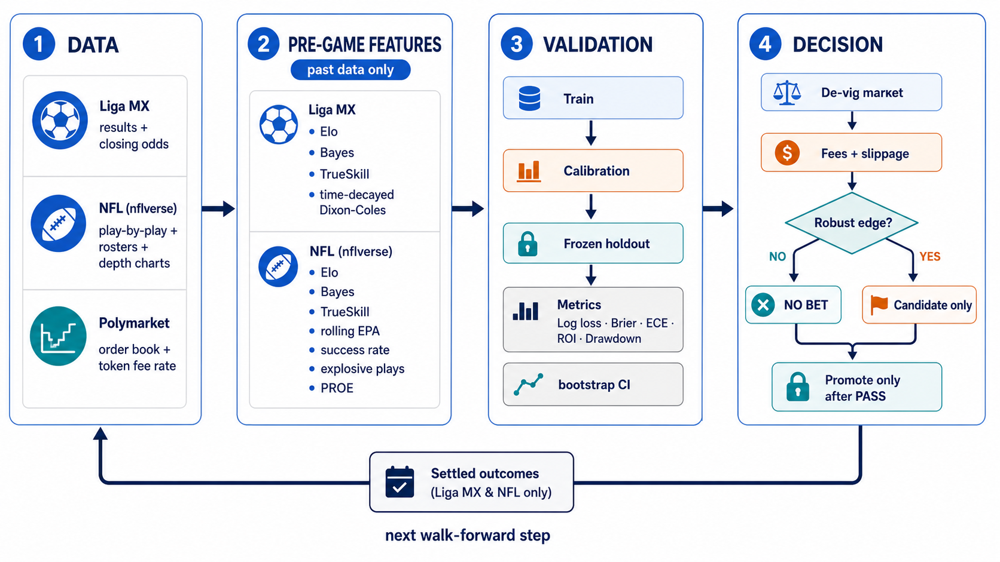

# Estado del arte aplicable a Liga MX y NFL

**Fecha de corte:** 2026-09-02 (revisión original: 2026-09-01)

**Alcance:** predicción prepartido y ejecución en Polymarket para Liga MX y NFL.

**Fuera de alcance:** Mundial, parlays, apuestas in-play y promesas de rentabilidad.

## Resumen ejecutivo

No existe evidencia responsable para afirmar que un modelo aislado —Poisson, Elo,
TrueSkill, boosting o una red neuronal— vaya a “vencer al mercado”. La evidencia más
útil apunta a un sistema completo: información no contenida todavía en el precio,
probabilidades calibradas, validación temporal verdaderamente fuera de muestra y coste
de ejecución real. Seleccionar por accuracy o por el mejor ROI observado invita al
sobreajuste; seleccionar por calibración y medir contra el mercado es más coherente con
la decisión de apostar ([Walsh & Joshi, 2024](https://doi.org/10.1016/j.mlwa.2024.100539);
[Bailey et al., 2016](https://doi.org/10.21314/JCF.2016.322)).

Los experimentos locales confirman ese diagnóstico. En Liga MX, Dixon-Coles temporal
mejoró al Poisson independiente, pero perdió contra las probabilidades de cierre. En
NFL, agregar ratings y EPA al mercado empeoró log-loss, Brier y calibración en el
holdout 2025. Por tanto, ambos son **challengers de investigación** y ninguna estrategia
fue promovida. La prioridad de mayor valor es capturar precios/ordenes históricos y
datos de disponibilidad de jugadores; añadir complejidad de modelo antes de eso no está
justificado.

## Pregunta y método de revisión

La pregunta fue: *¿qué mejoras, compatibles con los datos de Liga MX, NFL y la
microestructura actual de Polymarket, tienen evidencia suficiente para probarse sin
introducir look-ahead ni sobreajuste?*

Se buscaron trabajos y documentación hasta el 1 de septiembre de 2026 en índices DOI,
portales institucionales, repositorios de autores y documentación oficial. Las cadenas
combinaron `football score prediction`, `Dixon-Coles`, `dynamic bivariate Poisson`,
`expected goals betting calibration`, `NFL EPA prediction`, `sports betting market
calibration`, `backtest overfitting`, `Polymarket fee rate` y `order book`. Se incluyeron
estudios primarios con diseño probabilístico o económico explícito, implementaciones
oficiales reproducibles y documentación vigente del venue. Se excluyeron listas de
modelos sin holdout, testimonios de rentabilidad y resultados in-play no transferibles
directamente al prepartido. Los artículos 2026 se tratan como evidencia emergente, no
como resultados ya replicados en Liga MX o Polymarket.

## Benchmark reproducible del repositorio

### Liga MX: holdout 2025/26

El replay calcula cada feature antes del partido, usa 2022/23 como warmup, entrena en
2023/24, calibra en 2024/25 y congela 2025/26 como test (336 partidos). Menor es mejor;
el Brier mostrado aquí es el promedio multiclase dividido entre tres y no debe
compararse numéricamente con el Brier binario NFL.

| Modelo | Log-loss | Brier-3 |
|---|---:|---:|
| Mercado de cierre de-vig | **0.9774** | **0.19391** |
| Dixon-Coles temporal | 0.9957 | 0.19802 |
| Logística mercado + features | 1.0017 | 0.19944 |
| Logística calibrada | 1.0029 | 0.20033 |
| Poisson independiente | 1.0054 | 0.20028 |
| Gradient boosting calibrado | 1.0349 | 0.20690 |

Conclusión: la corrección de marcadores bajos y el decaimiento temporal son una mejora
real sobre el Poisson local, coherente con el modelo original de
[Dixon y Coles (1997)](https://doi.org/10.1111/1467-9876.00065), pero no aportan edge
incremental sobre el cierre. Los modelos dinámicos bivariados son una extensión
estadística razonable y han mostrado mejor pronóstico en ligas europeas
([Koopman & Lit, 2019](https://doi.org/10.1016/j.ijforecast.2018.10.011)); esa evidencia
no sustituye una validación específica de Liga MX.

### NFL: train 2022-23, calibración 2024, holdout 2025

El challenger usa 414 juegos de train, 208 de calibración y 208 de holdout después de
cuatro semanas de warmup por temporada. Combina el logit del moneyline de-vig con Elo,
Bayes, TrueSkill y diferencias rolling de EPA, success rate, explosivas y PROE.

| Modelo | Log-loss | Brier binario | ECE |
|---|---:|---:|---:|
| Mercado solo calibrado | **0.66534** | **0.46490** | **0.12336** |
| Mercado + ratings + EPA | 0.70461 | 0.49311 | 0.14157 |

La diferencia `log-loss mercado − challenger` fue **−0.03926**, con bootstrap IC 95%
**[−0.06521, −0.01256]**. El intervalo completo favorece al mercado; el gate es `FAIL`.
El reporte machine-readable vive en
[`editorial/reports/nfl_2026/2026-09-02_sota-evaluation.json`](../../editorial/reports/nfl_2026/2026-09-02_sota-evaluation.json).

### NFL: histórico Polymarket T-24h, corte 2026-09-02

El recolector público emparejó 524 contratos NFL y obtuvo 521 snapshots válidos a
T-24h; 520 observaciones no terminaron en empate. El precio histórico de Polymarket
superó a TrueSkill activo en log-loss, 0.59610 frente a 0.64358. La diferencia
`mercado − TrueSkill` fue **−0.04747**, con IC bootstrap 95%
**[−0.07661, −0.01946]**, completamente favorable al mercado.

El replay continuo de TrueSkill fue positivo (1,000 → 2,280.58 USDC; ROI +128.06%,
yield +8.24%, 262 apuestas y drawdown máximo 31.56%), pero no es estable: reiniciado
por temporada, 2024 dio ROI +120.38% y 2025 **−17.92%**, con drawdown 61.87%. Los
contratos incluidos indicaban fees deshabilitados, pero la API histórica no ofrece los
order books necesarios para reconstruir slippage. Por ambas razones el gate es `FAIL`.
El dataset y reporte reproducibles son
[`data/nfl_2026/ingest/polymarket_t24h.csv`](../../data/nfl_2026/ingest/polymarket_t24h.csv)
y
[`editorial/reports/nfl_2026/2026-09-02_pm-history.json`](../../editorial/reports/nfl_2026/2026-09-02_pm-history.json).

## Síntesis de la evidencia

### 1. El mercado es el baseline, no otro feature decorativo

Las cuotas agregan información pública y privada y suelen ser un baseline más difícil
que la frecuencia histórica. Hubáček, Šourek y Železný proponen aprender directamente
en relación con la utilidad de apostar, mientras que Walsh y Joshi muestran que la
selección por calibración puede ser más apropiada que la selección por accuracy
([Hubáček et al., 2019](https://doi.org/10.1016/j.ijforecast.2019.01.001);
[Walsh & Joshi, 2024](https://doi.org/10.1016/j.mlwa.2024.100539)). Esto no implica
copiar el precio: el test correcto es si las features mejoran un modelo `market-only`
fuera de muestra. En ambos deportes, ese es ahora el benchmark local.

Los resultados recientes que reportan edge deben leerse con cautela. Un estudio 2026
de Bundesliga combina xG reciente, Skellam y calibración isotónica y reporta señales no
contenidas completamente en las cuotas, pero también encuentra mejor calibración del
bookmaker y pertenece a otra liga y fuente de datos
([Wilkens, 2026](https://doi.org/10.1177/22150218261416681)). Para este repositorio es
una hipótesis de trabajo: **xG licenciado + modelo simple + calibración**, no evidencia
para activar apuestas en Liga MX.

### 2. Liga MX: dinámica y xG antes que una red más grande

Dixon-Coles corrige la dependencia de 0-0, 0-1, 1-0 y 1-1 y reduce el peso de partidos
antiguos; ambas ideas atacan fallas concretas del Poisson independiente
([Dixon & Coles, 1997](https://doi.org/10.1111/1467-9876.00065)). Los modelos
score-driven bivariados permiten que ataque y defensa evolucionen y ofrecen una ruta
posterior si el challenger simple se queda corto
([Koopman & Lit, 2019](https://doi.org/10.1016/j.ijforecast.2018.10.011)). El resultado
local —mejora contra Poisson pero no contra mercado— justifica conservar Dixon-Coles
como señal visible, no aumentar todavía su peso.

xG puede separar volumen/calidad de ocasiones del ruido del marcador; los modelos de
xG modernos usan geometría, tipo de tiro y contexto y deben validarse en el dominio
objetivo ([Mead et al., 2023](https://doi.org/10.1371/journal.pone.0282295)). El
repositorio abierto de StatsBomb ofrece eventos sólo para determinadas competiciones,
no una garantía de cobertura Liga MX actual
([Hudl/StatsBomb Open Data](https://github.com/hudl/open-data)). Hasta tener cobertura,
licencia, timestamp y lineage verificables, rellenar `xg` con proxies sería peor que
dejarlo nulo.

### 3. NFL: EPA es necesaria para investigar, no suficiente para superar la línea

nflverse publica play-by-play y recomienda consumir los artefactos versionados de
`nflverse-data`; eso permite reconstruir EPA y features pregame con timestamps
auditables ([nflverse-pbp](https://github.com/nflverse/nflverse-pbp);
[nflverse-data](https://github.com/nflverse/nflverse-data)). El uso correcto de rolling
EPA aplica `lag` para que cada encuentro vea sólo semanas previas y puede ponderar por
jugadas, una referencia reproducible que motivó la ingesta local
([nflverse, rolling EPA](https://github.com/nflverse/open-source-football/blob/master/_posts/2020-12-29-exploring-rolling-averages-of-epa/exploring-rolling-averages-of-epa.Rmd)).

El fallo del challenger no invalida EPA: demuestra que las versiones agregadas actuales
no añaden información al moneyline. Las siguientes pruebas deben ser residuales y
puntuales: EPA de pase ajustada por rival, CPOE/QB, presión/sacks, descanso/viaje y,
sobre todo, cambio de QB/disponibilidad confirmado antes del corte. La literatura sobre
EPA ajustada por calendario respalda controlar la fuerza del rival
([Pelechrinis, 2018](https://dtai.cs.kuleuven.be/events/MLSA18/papers/pelechrinis_mlsa18.pdf)),
pero la señal debe volver a pasar el mismo holdout. El release de injuries de nflverse
existe, aunque a la fecha no ofrece un asset 2026 consumible por esta ingesta; la DB lo
marca `partial` y no inventa jugadores disponibles
([nflverse injuries](https://github.com/nflverse/nflverse-data/releases/tag/injuries)).

### 4. La microestructura puede borrar un edge pequeño

Un precio negociable es el mejor `ask` y su profundidad, no el midpoint ni la última
operación. La API oficial devuelve bids, asks, tamaño mínimo y tick por token
([Polymarket order book](https://docs.polymarket.com/api-reference/market-data/get-order-book)).
Cada outcome tiene su propio token ID, que debe conservarse junto al snapshot
([Polymarket market data](https://docs.polymarket.com/market-data/overview)). Sin ese
histórico no se puede estimar slippage ni closing-line value de forma retrospectiva.

Polymarket cobra al taker en ciertas categorías. La fórmula vigente es
`shares × feeRate × p × (1−p)`, sólo para takers, redondeada a cinco decimales; la tabla
actual indica `0.05` para Sports
([Polymarket fees](https://docs.polymarket.com/trading/fees)). La tasa debe consultarse
por token porque el endpoint devuelve `base_fee` en basis points
([fee-rate API](https://docs.polymarket.com/api-reference/market-data/get-fee-rate)).
El código ya calcula ese coste y el backtest automático aplica 500 bps como escenario
histórico reproducible, no como constante live. La tasa live siempre se consulta por
token; el backtest sigue sin poder reconstruir slippage histórico.

En el snapshot público del 2 de septiembre, los cuatro tokens seleccionados de Liga MX
devolvieron `base_fee=1000` bps. Sus libros, top-3 asks, volumen, liquidez, tick y mínimo
quedaron visibles en el HTML. Todos resultaron `DISCARD` por volumen o edge y, por
tanto, `NO_TRADE`; NFL no tenía contrato emparejado para su próximo fixture y quedó
`SKIP`. No se calculó edge neto en filas sin sizing y no se envió ninguna orden.

El mismo corte valoró cinco shares de cada resultado H/D/A al mejor ask y con la tasa
específica de cada token. Los asks sumaron 1.01–1.05 y el coste all-in fue
1.07391–1.11163 por share; los cuatro complete sets quedaron `NO_EDGE`. El control se
archiva diariamente, pero nunca deriva una orden: cualquier coste menor que uno sólo
sería candidato a revisión humana.

### Intento adicional congelado: calibración Platt del precio

Se probó una sola hipótesis adicional sobre el histórico Polymarket NFL: calibración
Platt del logit del precio, ajustada sólo con 2024 y evaluada en 2025. En el corte
actual, el mercado 2025 obtuvo log-loss 0.606982, Brier 0.421396 y ECE 0.053962;
Platt empeoró a 0.615927, 0.428319 y 0.071345, respectivamente. El replay terminó en
884.53 USDC desde 1,000 (ROI −11.55%, yield −1.50%, 144 apuestas). La hipótesis queda
descartada y no se buscaron thresholds adicionales sobre el mismo holdout. En total se
evaluaron dos hipótesis sobre este histórico: TrueSkill activo y Platt de mercado.

### 5. Validar muchas estrategias produce ganadores falsos

El mejor resultado entre decenas de pesos, thresholds y temporadas puede ser azar. La
probabilidad de backtest overfitting aumenta cuando se elige la configuración después
de mirar todos los resultados; Bailey et al. formalizan pruebas para cuantificarlo
([Bailey et al., 2016](https://doi.org/10.21314/JCF.2016.322)). Por eso el repositorio
separa train, calibración y holdout congelado, publica challengers perdedores y no usa
el holdout para retocar hiperparámetros.

## Qué quedó implementado

- Liga MX muestra cinco lecturas separadas: Elo, Bayes, TrueSkill, Poisson y
  Dixon-Coles temporal. La estrategia activa no cambió.
- El de-vig `power`, log-loss, Brier y ECE tienen implementaciones puras y pruebas.
- La tasa por token y la fórmula de fees oficiales están centralizadas; el backtest
  reporta fees y declara que no dispone de slippage histórico.
- NFL ingiere calendario y play-by-play 2010-2025, más roster/depth chart 2026 (el PBP
  2026 aún no está publicado); la estrategia activa sigue filtrando historia desde 2022.
- El histórico Polymarket NFL conserva condition/token y el último precio público a
  T-24h; documenta explícitamente que no reconstruye books ni slippage pasados.
- El panel live falla cerrado: `SIMULATED_BUY` sólo existe para un `AUTO` con ask,
  profundidad, fee, tick y mínimo completos; todo lo demás es `NO_TRADE`.
- El experimento NFL usa train 2022-23, calibración 2024, holdout 2025, bootstrap y un
  gate explícito. Su resultado `FAIL` queda versionado.
- Los paneles HTML actuales se regeneran automáticamente y GitHub Pages publica el
  reporte de predicciones y el backtest al día.

## Hoja de ruta priorizada

### P0 — medición que hoy falta

1. Guardar por recomendación: timestamp, event/condition/token ID, vector completo de
   modelos, bid/ask y profundidad, `base_fee`, tamaño solicitado, fill medio y razón de
   `NO BET`.
2. Completar después del evento: precio de cierre bajo una definición fija, settlement,
   CLV, fee y slippage realizados. Sin esta tabla no puede distinguirse modelo de
   ejecución.
3. Conectar una fuente Liga MX con xG/eventos y una fuente NFL de injuries/QB con
   licencia, cobertura y timestamp auditables. Hasta entonces, los campos son `NULL` y
   una decisión sensible a disponibilidad debe bloquearse.

### P1 — challengers pequeños y falsables

1. Liga MX: modelo residual `mercado + Dixon-Coles + xG rolling`, calibrado por torneo
   corto. Comparar contra `market-only`, no sólo contra Poisson.
2. NFL: añadir EPA de pase/CPOE por QB y ajuste iterativo por rival. Hacer ablaciones:
   mercado; mercado+QB; mercado+EPA rival; conjunto completo.
3. Calibrar sólo en una ventana anterior y congelar la siguiente. Reportar log-loss,
   Brier, ECE, CLV, ROI neto, yield, número de apuestas y drawdown con intervalos.

### P2 — promoción y operación

Un challenger sólo puede proponerse para promoción si cumple simultáneamente:

- mejora de log-loss contra `market-only` con IC bootstrap 95% completamente positivo;
- Brier no peor y ECE no peor por más de 0.01;
- ROI y yield positivos **después** de fees/slippage, con su intervalo y al menos 300
  decisiones liquidadas fuera de muestra;
- estabilidad por temporada y segmento de precio, sin depender de un único año;
- revisión de todos los experimentos intentados para controlar selection bias;
- ninguna falta de datos crítica, especialmente QB/injuries NFL.

Cumplir el gate autoriza una revisión humana; no activa apuestas automáticamente.

## Limitaciones

Los precios históricos locales son cierres de bookmakers usados como proxy, no fills
de Polymarket. Liga MX no tiene aún xG ni disponibilidad de jugadores con lineage. NFL
no tiene injuries 2026 ni player-level EPA conectado a la DB. Los resultados 2026 de
otras ligas/venues pueden inspirar hipótesis, pero no son evidencia directa. Finalmente,
208 juegos NFL y 336 partidos Liga MX permiten detectar degradaciones grandes, no edges
minúsculos: la respuesta correcta ante incertidumbre es `NO BET`.

## Referencias

1. Mead, J., O’Hare, A., & McMenemy, P. (2023). *Expected goals in football: Improving model
   performance and demonstrating value*. PLOS ONE, 18(4), e0282295.
   https://doi.org/10.1371/journal.pone.0282295
2. Bailey, D. H., Borwein, J. M., López de Prado, M., & Zhu, Q. J. (2016). *The
   probability of backtest overfitting*. Journal of Computational Finance, 20(4).
   https://doi.org/10.21314/JCF.2016.322
3. Dixon, M. J., & Coles, S. G. (1997). *Modelling association football scores and
   inefficiencies in the football betting market*. Applied Statistics, 46(2), 265–280.
   https://doi.org/10.1111/1467-9876.00065
4. Hubáček, O., Šourek, G., & Železný, F. (2019). *Exploiting sports-betting market
   using machine learning*. International Journal of Forecasting, 35(2), 783–796.
   https://doi.org/10.1016/j.ijforecast.2019.01.001
5. Koopman, S. J., & Lit, R. (2019). *Forecasting football match results in national
   league competitions using score-driven time series models*. International Journal
   of Forecasting, 35(2), 797–809.
   https://doi.org/10.1016/j.ijforecast.2018.10.011
6. Pelechrinis, K. (2018). *Evaluating NFL plays: Expected points adjusted for
   schedule*. MLSA workshop.
   https://dtai.cs.kuleuven.be/events/MLSA18/papers/pelechrinis_mlsa18.pdf
7. Walsh, C., & Joshi, A. (2024). *Machine learning for sports betting: Should model
   selection be based on accuracy or calibration?* Machine Learning with Applications,
   16, 100539. https://doi.org/10.1016/j.mlwa.2024.100539
8. Wilkens, S. (2026). *Can simple models predict football—and beat the odds? Lessons
   from the German Bundesliga*. Journal of Sports Analytics.
   https://doi.org/10.1177/22150218261416681
9. nflverse. (2026). *nflverse-data* and *nflverse-pbp* [data and source code].
   https://github.com/nflverse/nflverse-data
10. Polymarket. (2026). *Fees; market data; order book; fee-rate API* [official
    documentation]. https://docs.polymarket.com/trading/fees
